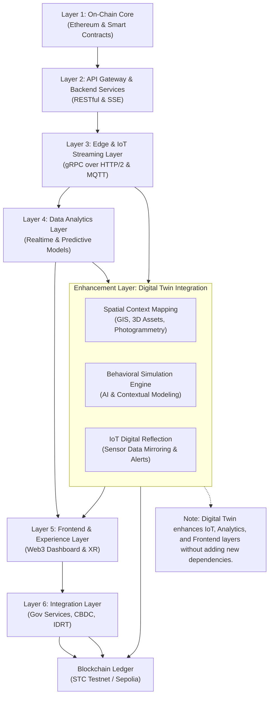

# 🧠 STC Ultimate: Digital Twin Architecture Layer  
**Version:** 1.0  
**Author:** ELPEEF Research Division  
**Project:** SmartTourismChain (STC Ultimate)  
**Last Updated:** November 2025  

---

## 1. Executive Summary  

The **Digital Twin Architecture Layer** in STC Ultimate represents an evolutionary bridge between **physical tourism assets** and their **cyber-physical representations** within a decentralized blockchain ecosystem.  
This design aims to align with **Tourism 5.0** and **Human Cyber-Physical Systems (HCPS)** paradigms — where travelers, destinations, IoT devices, and smart contracts interact seamlessly within a transparent, data-driven, and automated tourism network.  

Instead of introducing a separate module, the Digital Twin layer enhances existing STC components through **data synchronization**, **real-time simulation**, and **AI-driven contextual analytics**, enabling both **predictive management** and **immersive experiences** for destinations, operators, and tourists.

---

## 2. System Architecture  

The STC Ultimate stack consists of **six primary layers**, now extended with the **Digital Twin enhancement** as a cross-layer extension.

---

## 3. Integration with IDRT & CBDC Layer

The Digital Twin layer operates synergistically with Layer 6 to support:

- Transaction Simulation: Predictive modeling of tokenized tourism flows using IDRT stablecoin or CBDC proxy assets.

- Service Automation: Automated booking, escrow, and refund contracts reflecting real-world states.

- Audit Synchronization: Immutable mirroring of digital twin telemetry data onto the blockchain for transparency and compliance.

This allows policymakers and tourism operators to view a live digital mirror of economic, environmental, and operational performance in real time.

---

## 4. Use Case: Pulau Penyengat Digital Heritage

In the Pulau Penyengat Digital Heritage Initiative, the Digital Twin layer models:

- Cultural Sites in 3D (Masjid Raya, Istana, etc.) linked to NFT-based authenticity records.

- Visitor Behavior Simulation via anonymous mobility data and IoT beacons.

- Environmental Monitoring (humidity, sea tide, visitor density) synchronized to blockchain logs.

- AI Recommendation Layer that adapts route and conservation actions dynamically.

This model transforms static tourism data into a living, learning ecosystem — aligning conservation with digital engagement.

---

## 5. Future Roadmap

Phase	Objective	Key Technologies

- Phase 1 (Q1 2026)	Deploy STC Digital Twin SDK	Unreal Engine Plugin, CesiumJS, TwinMaker API
- Phase 2 (Q2 2026)	Spatial Ledger Integration	zkSync + GeoHash Encoding
- Phase 3 (Q3 2026)	AI Context Prediction	LLM + Spatiotemporal Reinforcement Model
- Phase 4 (Q4 2026)	Full XR Immersion Layer	WebXR + haptics + real-time blockchain sync

---

## 6. Closing Reflection

> “We used to visit places.
> Now, we also visit their reflections —
> preserved, alive, and ever-learning.”

The Digital Twin layer is not a new addition, but an awakening of the system —
turning STC Ultimate from a transactional engine into a living digital organism for sustainable, transparent, and intelligent tourism.

---

Repository: github.com/mrbrightsides

License: MIT © 2025 ELPEEF Research Division
